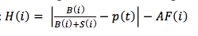
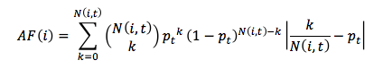

# FinancialHerdingAnalysis

Simple program to process and analyse financial data for herding.

## Main formula - Herding Formula

## Secondary Formula - Adjustment Factor Formula

## Process

Walkthrough of how data makes it way through the formula.

1. B(i) and S(i) are computed for each security for each quarter, these numbers refer to where the stock increased or decreased in the relevant quarter, respectively. For each institution that increased their number of shares held for that security, B(i) is incremented, for each institution that decreased their number of shares held, S(i) is incremented. This is done on a per security basis, looking at the shares held for that security by each institution

2. With these numbers N(i,t) and p(t) can be worked out.

## Mathmatical Notation and Financial Lingo Reference

* | TK | - absolute number (distance from 0, so always positive).
* (i) - per security
* (t) - per quarter
* k - just the current increment in the formula, programming equivalent would typically be `i` - is the upper limit of k just the number of dates a security has.
* Security Ticker - just the reference to a company on an exchange, e.g. GOOG for Google
* Institution - Organisation holding the shares/investments, referred to in data by an alphanumeric code in first column.
* Holdings - number of shares held
* Active managers - Institutions that are active from one quarter to the next, active meaning that their holdings increase or decrease.

## Installing and running the program

Windows/macOS/Linux?